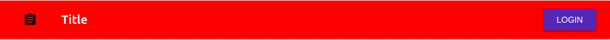

# AppBar

The top App Bar provides content and actions related to the current screen. It’s used for branding, screen titles, navigation, and actions.

## Compatibility

| 🌏 Web | 🖥 Electron | 📱 React Native |
| :----: | :---------: | :-------------: |
| ✔️     | ✖           | ✖               |

## Screenshots

| 🌏 Web                                 | 🖥 Electron | 📱 React Native |
| :------------------------------------: | :---------: | :-------------: |
|  | TBD         | TBD             |

## Universal Props

| Name  | Type      | Default | Description                        |
| :---- | :-------- | :------ | :--------------------------------- |
| left  | ReactNode |         | left prop for AppBar component     |
| title | string    |         | title prop for AppBar component.   |
| right | ReactNode |         | right prop for   AppBar component. |

## Props

| Name      | Type                                                      | Default | Description                                              |
| :-------- | :-------------------------------------------------------- | :------ | :------------------------------------------------------- |
| style     | Object                                                    |         | Get the style object                                     |
| color     | enum: 'inherit', 'primary', 'secondary', 'default'        |         | Background color for AppBar.                             |
| children  | Node                                                      |         | Children of AppBar.                                      |
| position  | enum: 'static', 'fixed', 'absolute', 'relative', 'sticky' |         | Position of AppBar.                                      |
| className | string                                                    |         | className props to extend styles through CSS for AppBar. |

## How to use

```JavaScript
import React from 'react';
import { BlueRainConsumer, BlueRain } from '@blueeast/bluerain-os';

const AppBarSample = (props) => (
   return (
    <BlueRainConsumer>
    {(BR:BlueRain) => (
        <AppBar
     left={<Button fab={true} style={AppBarStoriesStyle}><Icon name="assignment"/></Button>}
     title={'Title'}
     right={<Button color="primary">Login</Button>}
     position="fixed"
     color="primary"
     style={{ backgroundColor: 'red' }}/>
    )}
    </BlueRainCosumer>);

export default AppBarSample;
```