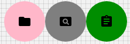

# Avatar

Avatars are found throughout material design with uses in everything from tables to dialog menus.

## Compatibility

| 🌏 Web | 🖥 Electron | 📱 React Native |
| :----: | :---------: | :-------------: |
| ✔️      | ✖            | ✖              |

## Screenshots

| 🌏 Web | 🖥 Electron | 📱 React Native |
| :---: | :--------: | :------------: |
|  |    TBD   | TBD |

## Universal Props

| Name | Type | Default | Description |
|:-----|:-----|:--------|:------------|
| style | Object |  | Get the style object |
| src | string | | src of image. |
| children | Node | | Children of avatar. |

## Specific Library Props

| Name | Type | Default | Description |
|:-----|:-----|:--------|:------------|
| alt | string |  | string to be shown if image was not rendered due to any error. |
| classes | object | | classes prop to override styling. |
| component | string or function | 'div' | Component with which the avatar will be rendered |
| imgProps | Object |  | Props of image tag. |
| sizes | string | | sizes of image. |

## How to use

```JavaScript
import React from 'react';
import BR from '@blueeast/bluerain-os';

const AvatarSample = (props) => {
    const Avatar = BR.Components.get('Avatar');
    return (
        <Avatar
        alt="Remy Sharp"
        src="https://material-ui-next.com/static/images/remy.jpg"
        style={{height:35,width:35}}
        />);
};

export default AvatarSample;
```
