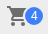

# Badge

 Badge generates a small badge to the top-right of its child(ren)

## Compatibility

| 🌏 Web | 🖥 Electron | 📱 React Native |
| :----: | :---------: | :-------------: |
| ✔️      | ✖            | ✖              |

## Screenshots

| 🌏 Web | 🖥 Electron | 📱 React Native |
| :---: | :--------: | :------------: |
|  |    TBD   | TBD |

## Universal Props

| Name | Type | Default | Description |
|:-----|:-----|:--------|:------------|
| style | Object |  | Get the style object |
| badgeContent | ReactNode | | Content of the Badge |

## Specific Library Props

| Name | Type | Default | Description |
|:-----|:-----|:--------|:------------|
| color | string |  | The color of the Badge. |

## How to use

```JavaScript
import React from 'react';
import BR from '@blueeast/bluerain-os';

const BadgeSample = (props) => (
    const Badge = BR.Components.get('Badge');
    return <Badge badgeContent = {'786'} color = {'primary'}/>;

export default BadgeSample;
```