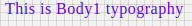

# Body1 Component

Typography component for Body1. It applies following styles. Styles are fixed, cannot be overriden.

```javascript
{
    'fontFamily':'Roboto',
    'fontWeight':400,
    'fontSize':16,
    'letterSpacing': 0.5
 };
```

## Compatibility

| 🌏 Web | 🖥 Electron | 📱 React Native |
| :----: | :---------: | :-------------: |
| ✔️     | ✖           | ✖             |

## Screenshots

| 🌏 Web | 🖥 Electron | 📱 React Native |
| :---: | :--------: | :------------: |
|   |    TBD   |  TBD |

## Body1

### Props

| Name     | Type      | Default | Description                |
| :------- | :-------- | :------ | :------------------------- |
| children | string |         | The text to show with Body1 heading style

## How to use

```react
import React from 'react';
import B R from '@blueeast/bluerain-os';

const Body1 = BR.Components.get('Body1');


const component = (props) => {
        <Body1>Body1 Typography</Body1>
    );
}

export default Body1

```