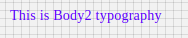

# Body2 Component

Typography component for Body. It applies following styles. Styles are fixed, cannot be overriden.

```javascript
{
    'fontFamily':'Roboto',
    'fontWeight':400,
    'fontSize':14,
    'letterSpacing': 0.25
};
```

## Compatibility

| 🌏 Web | 🖥 Electron | 📱 React Native |
| :----: | :---------: | :-------------: |
| ✔️     | ✖           | ✖               |

## Screenshots

| 🌏 Web                                | 🖥 Electron | 📱 React Native |
| :-----------------------------------: | :---------: | :-------------: |
|  | TBD         | TBD             |

## Body2

### Props

| Name     | Type   | Default | Description                               |
| :------- | :----- | :------ | :---------------------------------------- |
| children | string |         | The text to show with Body2 heading style |

## Screenshots

| 🌏 Web | 🖥 Electron | 📱 React Native                          |
| :----: | :---------: | :--------------------------------------: |
| TBD    | TBD         |  |

## How to use

```javascript
import React from 'react';
import BR from '@blueeast/bluerain-os';

const Body2 = BR.Components.get('Body2');
const component = (props) => {
        <Body2>Body2 Typography</Body2>
    );
}

export default Body2

```