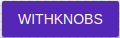

# Button

Buttons allow users to take actions, and make choices, with a single tap.

## Compatibility

| 🌏 Web | 🖥 Electron | 📱 React Native |
| :----: | :---------: | :-------------: |
| ✔️      | ✖            | ✖              |

## Screenshots

| 🌏 Web | 🖥 Electron | 📱 React Native |
| :---: | :--------: | :------------: |
|  |    TBD   | TBD |

## Universal Props

| Name | Type | Default | Description |
|:-----|:-----|:--------|:------------|
| style | Object | | style object for button. |
| children | Node | | Content of the button component. |
| color | enum:'default' ,'inherit' ,'primary','secondary' | 'default' | Color of button component.|
| onClick | func | () => {} | Callback function fired when button is clicked. |
| disabled | bool |  | If true, renders a disabled button. |
| href | string | | href prop to move to a link. |
| fullWidth | bool |  | If true, button is generated with 100% width of the cnotainer. |
| iconLeft | Node |  | icon prop to show icon on the left side of label. |
| iconRight | Node | | icon prop to show icon on the right side of label. |
| small | bool |  | If true, renders a small sized button. |
| large | bool |  | If true, renders a large sized button.|
| variant | enum |'text' , 'flat' , 'outlined' , 'contained' , 'raised' , 'fab' , 'extendedFab'  | If true, renders a large sized button.|

## Specific Library Props

| Name | Type | Default | Description |
|:-----|:-----|:--------|:------------|
| tag | func, string | button | tag prop to generate component with any other component and not with default 'button'. |
| size | enum:'small','medium','large' |  | Useful to set size of button component. |

## How to use

```JavaScript
import React from 'react';
import Button from  'bluerain-plugin-bootstrap-ui/Button';

const buttonSample = () => (
       <Button fullWidth color='primary'>Click me!</Button>
);

export default buttonSample;
```