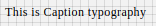

# Caption Component

Typography component for Caption. It applies following styles. Styles are fixed, cannot be overriden.

```javascript
{
    'fontFamily': 'Roboto',
    'fontWeight': '400',
    'fontSize': 12,
    'letterSpacing': 0.4
};
```

## Compatibility

| 🌏 Web | 🖥 Electron | 📱 React Native |
| :----: | :---------: | :-------------: |
|  ✔️     | ✖           |  ✖               |

## Screenshots

| 🌏 Web | 🖥 Electron | 📱 React Native |
| :---: | :--------: | :------------: |
|    |    TBD   | TBD |

## Caption

### Props

| Name     | Type      | Default | Description                |
| :------- | :-------- | :------ | :------------------------- |
| children | string |         | The text to show with Caption heading style

## How to use

```javascript
import React from 'react';
import BR from "@blueeast/bluerain-os"
const Caption = BR.Components.get('Caption');

const CaptionSample = () => {
        <Caption>This is Caption typography</Caption>
    );
}

export default CaptionSample

```