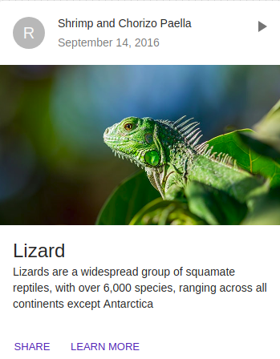

# Card

Cards are surfaces that display content and actions on a single topic.

## Compatibility

| 🌏 Web | 🖥 Electron | 📱 React Native |
| :----: | :---------: | :-------------: |
| ✔️     | ✖           | ✖             |

## Screenshots

| 🌏 Web | 🖥 Electron | 📱 React Native |
| :---: | :--------: | :------------: |
|   |    TBD   |  TBD |

## Universal Props

| Name | Type | Default | Description |
|:-----|:-----|:--------|:------------|
| style | Object | | style object for Card. |
| children | Node | | Children of Card component. |
| raised | bool | true | If true, Card is generated with raised styling (with border).|
| tag | string or func | div | Tag with which the Component will be rendered. |
| className | string |  | className for styling component with css. |

## Specific Library Props

| Name | Type | Default | Description |
|:-----|:-----|:--------|:------------|
| elevation | number |  | For shadow of component, can be from 0-24 |
| square | bool | false | If true, card has no rounded corners. |

## CardHeader Component

## CardHeader Universal Props

| Name | Type | Default | Description |
|:-----|:-----|:--------|:------------|
| style | Object | | style object for CardHeader. |
| children | Node | | Children of CardHeader component. |
| title | Node | | title of the CardHeader.|
| className | string |  | className for styling component with css. |

## CardHeader Specific Library Props

| Name | Type | Default | Description |
|:-----|:-----|:--------|:------------|
| action | Node |  | The action to display in the card header. |
| subheader | Node |  | The content of the component. |
| classes | Object |  | Useful to extend the style applied to components. |
| avatar | Node |  | The Avatar for the Card Header. |

## CardMedia

## CardMedia Universal Props

| Name | Type | Default | Description |
|:-----|:-----|:--------|:------------|
| style | Object |  | style object for CardMedia. |
| src | string |  | src for the CardMedia.|
| className | string |  | className for styling component with css. |
| height | number | 200 | Height of the image to be given in 'px'. |

## CardAction Component


## CardAction Universal Props

| Name | Type | Default | Description |
|:-----|:-----|:--------|:------------|
| style | Object |  | style object for CardBody. |
| children | Node | | Children of CardBody component. |
| className | string |  | className for styling component with css. |

## CardActionArea Component

## CardActionArea Universal Props

| Name | Type | Default | Description |
|:-----|:-----|:--------|:------------|
| style | Object |  | style object for CardBody. |
| children | Node | | Children of CardBody component. |
| className | string |  | className for styling component with css. |

## CardBody Component

## CardBody Specific Library Props

| Name | Type | Default | Description |
|:-----|:-----|:--------|:------------|
| classes | Object |  | Useful to extend the style applied to components. |

## CardFooter Component

## CardFooter Universal Props

| Name | Type | Default | Description |
|:-----|:-----|:--------|:------------|
| style | Object |  | style object for CardFooter. |
| children | Node | | Children of CardFooter component. |
| className | string |  | className for styling component with css. |

## CardFooter Specific Library Props

| Name | Type | Default | Description |
|:-----|:-----|:--------|:------------|
| classes | Object |  | Useful to extend the style applied to components. |
| disableActionSpacing | bool | false | If true, the card actions do not have additional margin. |

## How to use

```JavaScript
import React from 'react';
import { withBluerain } from "@blueeast/bluerain-os";


const myCard = (props) => {
    const BR = props.bluerain;
    const Card = BR.Components.get('Card');
    const CardMedia = BR.Components.get('CardMedia');
    const CardBody = BR.Components.get('CardBody');
    const Button = BR.Components.get('Button');
    return (
    <Card style={{width:300}} >
        <CardHeader
            title="Shrimp and Chorizo Paella"
            subheader="September 14, 2016"
        />
        <CardMedia src="https://placeholdit.imgix.net/~text?txtsize=33&txt=318%C3%97180&w=318&h=180" height={400} />
        <CardBody>
          <h2>Card Title</CardTih2tle>
          <p>This is a wider card with supporting text below as a natural lead-in to additional content. This content is a little bit longer.</p>
          <p>
            <small className="text-muted">Last updated 3 mins ago</small>
          </p>
        </CardBody>
        <CardFooter disableActionSpacing>
          <Button dense>Learn More</Button>
        </CardFooter>
    </Card>
    );
}

export default withBluerain(myCard);
```
