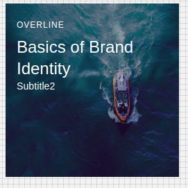

# CardViewMedia Component

## Compatibility

| 🌏 Web | 🖥 Electron | 📱 React Native |
| :----: | :---------: | :-------------: |
| ✔️       | ✖           | ✖             |

## Screenshots

| 🌏 Web | 🖥 Electron | 📱 React Native                  |
| :----: | :---------: | :------------------------------: |
| TBD    | TBD         |  |
|        |

## CardViewMedia

### Props

| Name   | Type   | Default | Description                                                |
| :----- | :----- | :------ | :--------------------------------------------------------- |
| mediaComponent?  | enum |         | 'video' | ' audio' | 'picture' | 'iframe' | 'img' | 'component'; |
| src    | string |         | src for the CardMedia.                                     |
| overlayTitle | ReactNode  |         | overlay title can be text or any componenet    |
| overlaySubTiltle    | ReactNode   |         | overlay title can be text or any componenet       |
| overlayOverline | ReactNode   |         | overlay title can be text or any componenet      |
| overlayDirection | enum |         |can be top left ,top right ,bottom left bottm right |
| mediaHeight | number   |         |for media height |
| mediaWidth | number   |         |for media width |
|overlayColor|string|         |overlay color should be in rgba form|
## How to use


const CardMedia = BR.Components.get('CardViewMedia');
const H5 = BR.Components.get('H5');
const Subtitle2 = BR.Components.get('Subtitle2');
const Overline = BR.Components.get('Overline');
const View = BR.Components.get('View');

```react
import React from 'react';

const myCard = (props) => {

     <CardViewMedia
            overlayTitle={<View><Overline style={{ color: 'white' }}>Overline</Overline></View>}
            overlaySubTiltle={<View><H5 style={{ color: 'red' }}>Basics of Brand Identity</H5></View >}
            overlayOverline={<View><Subtitle2 style={{ color: 'white' }}>Subtitle2</Subtitle2></View >}
            overlayColor={'rgba(30,24,40,0.35)'}
            mediaComponent='img'
            overlayDirection='topLeft'
            mediaWidth={220}
            mediaHeight={220}
            src="https://images.unsplash.com/photo-1541828985935-1fe979f9fc0b?ixlib=rb-0.3.5&ixid=eyJhcHBfaWQiOjEyMDd9&s=42ae3092ed745c9b579463975f7494ad&auto=format&fit=crop&w=500&q=60"
          />
}

```