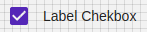

# Checkbox

Checkboxes allow the user to select one or more items from a set. Checkboxes can be used to turn an option on or off.

## Compatibility

| 🌏 Web | 🖥 Electron | 📱 React Native |
| :----: | :---------: | :-------------: |
| ✔️     | ✖           | ✖             |

## Screenshots

| 🌏 Web | 🖥 Electron | 📱 React Native |
| :---: | :--------: | :------------: |
|   |    TBD   |  TBD |

## Props

| Name | Type | Default | Description |
|:-----|:-----|:--------|:------------|
| disabled | boolean | false | If true, disable all interactions for this component. |
| onChange | () => {} |  | Callback when the checkbox is pressed. |
| color | string | | color of checkbox. (not supported for bootstrap). |
| label | Node |  | label to show with checkbox. |
| value | boolean | | The value of the checkbox. If true the checkbox will be turned on. Default value is false (not supported for Bootstrap). |
| testID | string | | Used to locate this view in end-to-end tests. Substitute of value prop for MUI Checkbox. |

## All Material-UI Props are also supported

## How to use

```JavaScript
import React from 'react';
import  BR from "@blueeast/bluerain-os";

const CheckboxSample = (props) => {

    return (
        <BR.Components.Checkbox label="disabled" color="red" disabled={true} value={false}  />
    )
}

export default CheckboxSample;
```
