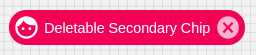

# Chip

Chips are compact elements that represent an input, attribute, or action.
Chips allow users to enter information, make selections, filter content, or trigger actions

## Compatibility

| 🌏 Web | 🖥 Electron | 📱 React Native |
| :----: | :---------: | :-------------: |
| ✔️      | ✖            | ✖              |

## Screenshots

| 🌏 Web | 🖥 Electron | 📱 React Native |
| :---: | :--------: | :------------: |
|  |    TBD   | TBD |

## Specific Library Props

| Name | Type | Default | Description |
|:-----|:-----|:--------|:------------|
| variant | 'outlined' | 'default' |  | The content of the label. |
| onDelete | () => void | | Callback function fired when the delete icon is clicked. If set, the delete icon will be shown. |
| deleteIcon | React.ReactElement | | Custom delete icon element. Will be shown only if onDelete is set. |
| onClick | () => void | | Function when clicked on chip. |
| label | ReactNode | | label for chip. |
| component | React.ReactType | | component for chip. |
| avatar | React.ReactElement | | avatar for chip. |
| icon | React.ReactElement | | icon for chip. |
| clickable | boolean | | Clickable enable/disable for chip. |
| style | object | | style object for chip. |

## How to use

```JavaScript
import React from 'react';
import { BlueRainConsumer, BlueRain } from '@blueeast/bluerain-os';

const ChipSample = (props) => (
    <BlueRainConsumer>
    {(BR:BlueRain)=>
      (<BR.Components.Chip
            style={{'background-color':'red'}}
            label="Basic Chip"
            color="secondary"
            onDelete={() => 'Dummy'}
     />)  }
    </BlueRainConsumer>
    );

export default ChipSample;
```
