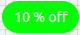

# Chip

Chips are compact elements that represent an input, attribute, or action.
Chips allow users to enter information, make selections, filter content, or trigger actions

## Compatibility

| 🌏 Web | 🖥 Electron | 📱 React Native |
| :----: | :---------: | :-------------: |
| ✔️      | ✖            | ✖              |

## Screenshots

| 🌏 Web | 🖥 Electron | 📱 React Native |
| :---: | :--------: | :------------: |
|  |    TBD   | TBD |

## Universal Props

| Name | Type | Default | Description |
|:-----|:-----|:--------|:------------|
| style | Object |  | Get the style object |
| children | ReactNode | | Content of the Chip |

## Specific Library Props

| Name | Type | Default | Description |
|:-----|:-----|:--------|:------------|
| label | string |  | The content of the label. |
| onDelete | ReactNode | | Callback function fired when the delete icon is clicked. If set, the delete icon will be shown. |
| deleteIcon | ReactNode | | Custom delete icon element. Will be shown only if onDelete is set. |
| onClick | ReactNode | | Function when clicked on chip. |

## How to use

```JavaScript
import React from 'react';
import { withBluerain } from '@blueeast/bluerain-os';

const ChipSample = (props) => (
    const BR = props.bluerain;
    const Chip = BR.Components.get('Chip');
    <Chip style={{'background-color':'green'}}>10 % off</Chip>);

export default withBluerain(ChipSample);
```
