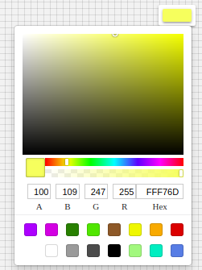

# ColorPicker

## Compatibility

| 🌏 Web | 🖥 Electron | 📱 React Native |
| :----: | :---------: | :-------------: |
| ✔️     | ✖           | ✖             |

## Screenshots

| 🌏 Web | 🖥 Electron | 📱 React Native |
| :---: | :--------: | :------------: |
|   |    TBD   |  TBD |

## Props

| Name | Type | Default | Description |
|:-----|:-----|:--------|:------------|
| label | string | Color | Label of the colorpicker component. |
| value | Object or string | {r:'109', g:'113', b:'199', a:'100'} | Object value should be passed like this. The same way, 'hsl' value is expected to be passed. This will be the default color of the button. Range of "h" should be from 0 to 360, "s" should be from 0 to 1 and "l" should be from 0 to 1. If both 'rgba' and 'hsl' are present in the object then the component depends on hs value. If prop 'hs' is true then 'hsl' value is used to generate the component and if it is not true then 'rgba' is used to generate the color picker component. If value is a string that possess name of the color or hash code then the component's look again depends on prop 'hs'.  |
| hs | bool | false | If passed true, ColorPicker component is generated with HSA colors support and expects h,s,l attributes in value prop. |
| onChange | Function | () => {} | Callback function for when the ColorPicker component changes the color. |

## Component Usages

 If 'value' prop is not provided, "transparent" is used as it is set as defaultColor.

## How to use

Below is the sample code to use the component:

```JavaScript
import React from 'react';
import { withBluerain } from '@blueeast/bluerain-os';

const ColorPickerSample = (props) => (
    const BR = props.bluerain;
    const ColorPicker = BR.Components.get('ColorPicker');
    const View = BR.Components.get('View');
    <View>
    <ColorPicker
  value={hsl}
  hs
 />
    <ColorPicker
  value="#2AF795"
    />
    <ColorPicker
  value={{
 h: '180',
 s: '0.5',
 l: '0.5',
 r: '255',
 g: '112',
 b: '19',
 a: '1',
    }}
    />
  </View>);

export default withBluerain(ColorPickerSample);

### Behaviors
1. Normal state with "hs" prop false: Normal state of the component shows a button in which default value of color is being shown and when this button is clicked, Color Picker is shown in which it shows the default color that was set by using the prop "value". Changing the color behaves as the prop "onChange" demands.  

2. Normal state with "hs" prop true: Normal state of the component shows a button in which default value of color is being shown and when this button is clicked, Color Picker is shown in which it shows the default color that was set by using the prop "value" and gives support of HSL color support. Arrow control can be used to switch to either RGBA, HEX or HSL supporting Colorpicker. Changing the color behaves as the prop "onChange" demands.  

3. Empty state: No empty state.
4. Error Handling: If bad data is provided, a message is shown to the user as can be seen in the below.  

5. Error Handling: If "hs" prop is true and value is not given in hsl format, then a message is shown to the user as can be seen in the below.  


