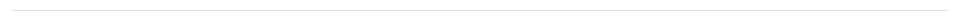

# Divider

A divider is a thin line that groups content in lists and layouts.

## Compatibility

| 🌏 Web | 🖥 Electron | 📱 React Native |
| :----: | :---------: | :-------------: |
| ✔️     | ✖           | ✖             |

## Screenshots

| 🌏 Web | 🖥 Electron | 📱 React Native |
| :---: | :--------: | :------------: |
|   |    TBD   |  TBD |

## Universal Props

| Name | Type | Default | Description |
|:-----|:-----|:--------|:------------|
| light | bool | | If true, Divider is generated with light color. |

## Specific Library Props

| Name | Type | Default | Description |
|:-----|:-----|:--------|:------------|
| component | Node | hr | component to generate Divider with. |
| inset | bool |  | if true, Divider is generated indented. |
| absolute | bool | false | Position of component. |

## How to use

```JavaScript
import React from 'react';
import BR from '@blueeast/bluerain-os';

const DividerSample = (props) => (

    const Divider = BR.Components.get('Divider');
    return <Divider light={false} />;

export default DividerSample;
```