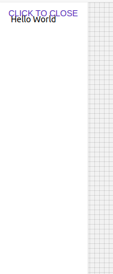

# Drawer

Navigation drawers provide access to destinations in your app. Side sheets are surfaces containing supplementary content that are anchored to the left or right edge of the screen.

## Compatibility

| 🌏 Web | 🖥 Electron | 📱 React Native |
| :----: | :---------: | :-------------: |
| ✔️     | ✖           | ✖             |

## Screenshots

| 🌏 Web | 🖥 Electron | 📱 React Native |
| :---: | :--------: | :------------: |
|   |    TBD   |  TBD |

## Props

| Name | Type | Default | Description |
|:-----|:-----|:--------|:------------|
| children | ReactNode | | Children of Drawer component. |
| style | object| | style object Drawer component. |
| width | number | | width of Drawer component. |
| onStateChanged | (event: object) => void | |  called on state change of Drawer component. |
| open | boolean | | open prop for Drawer component. |
| type | string | 'temporary' , 'persistent' , 'permanent'| type for Drawer component. |

## Specific Library Props

| Name | Type | Default | Description |
|:-----|:-----|:--------|:------------|
| Variant | string |  'permanent' , 'persistent' , 'temporary' | Varient for Drawer Component |
| side | string |  | side prop for Drawer component |
| tweenDuration| number |  | Tween Duraion for Drawer of component. |

## How to use

```JavaScript
import React from 'react';
import BR from '@blueeast/bluerain-os';

const DrawerSample = (props) => {

    const Drawer = BR.Components.get('Drawer');
    return (
      <Drawer
        variant="persistent"
        open={true}
        tweenDuration={1000}
        side="left"
        style={AppBarStoriesStyle}
      />
    );
    }

export default DrawerSample;