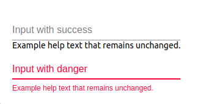

# FormControl

## Compatibility

| 🌏 Web | 🖥 Electron | 📱 React Native |
| :----: | :---------: | :-------------: |
| ✔️      | ✖            | ✖              |

## Screenshots

| 🌏 Web | 🖥 Electron | 📱 React Native |
| :---: | :--------: | :------------: |
|  |    TBD   | TBD |

## Universal Props

| Name | Type | Default | Description |
|:-----|:-----|:--------|:------------|
| style | Object | | style object for FormControl component. |
| children | ReactNode | | Children prop for FormControl component. |
| Component | ReactNode | | component prop for FormControl component. |
| className | string| | ClassName for FormControl component. |

## Specific Library Props

| Name | Type | Default | Description |
|:-----|:-----|:--------|:------------|
| disabled | boolean |  | disabled prop for the FormControl.|
| error| boolean |   | error prop for the FormControl. |
| fullWidth | boolean |  | fullWidth prop for the FormControl. |
| margin | string | 'none' ,'dense','normal'  |margin prop for the FormControl. |
| required | boolean |  |required prop for the FormControl. |
| component | string |  |component prop for the FormControl. |

## FormGroup

## FormGroup Universal Props

| Name | Type | Default | Description |
|:-----|:-----|:--------|:------------|
| style | Object | | style object for FormGroup component. |
| children | ReactNode | | Children prop for FormGroup component. |
| Component | ReactNode | | component prop for FormGroup component. |
| className | string| | ClassName for FormGroup component. |

## How to use

```JavaScript
import React from 'react';
import BR  from "@blueeast/bluerain-os";

const FormSample =(props)=> {
   const FormControl = BR.Components.get('FormControl');
   const FormGroup = BR.Components.get('FormGroup');
   const TextInput = BR.Components.get('TextInput');
   const Text = BR.Components.get('Text');
   return (
    <FormControl>
        <FormGroup>
         <TextInput label="Input with success"/>
         <Text>Example help text that remains unchanged.</Text>
        </FormGroup>
        <FormGroup>
         <TextInput label="Input with danger" error={true} errorText={'Example help text that remains unchanged.'}/>
        </FormGroup>
    </FormControl>
  );

};

export default withBluerain(myList);
```
