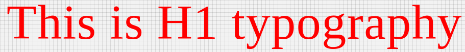

# H1 Component

Typography component for headings h1. It applies following styles. Styles are fixed, cannot be overriden.

```javascript
{
   'fontFamily':'Roboto',
   'fontWeight':300,
   'fontSize':96,
   'letterSpacing': 1.5
}
```

## Compatibility

| 🌏 Web | 🖥 Electron | 📱 React Native |
| :----: | :---------: | :-------------: |
| ✔️      | ✖            | ✖              |

## Screenshots

| 🌏 Web | 🖥 Electron | 📱 React Native |
| :---: | :--------: | :------------: |
|  |    TBD   | TBD |

### Props

| Name     | Type      | Default | Description                |
| :------- | :-------- | :------ | :------------------------- |
| children | string |         | The text to show with H1 heading style |
| style | object |         | style object for H1 |

## How to use

```javascript
import React from 'react';
import Br from '@blueeast/bluerain-os';

const H1 = BR.Components.get('H1');

const H1Sample = (props) => ()
        <H1>H1 Typography</H1>
    );

export default H1Sample;

```