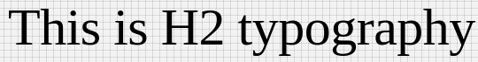

# H2 Component

Typography component for headings. It applies following styles. Styles are fixed, cannot be overriden.

```javascript
{
    'fontFamily':'Roboto',
    'fontWeight':300,
    'fontSize':60,
    'letterSpacing': -0.5
 }
```

## Compatibility

| 🌏 Web | 🖥 Electron | 📱 React Native |
| :----: | :---------: | :-------------: |
|  ✔️       | ✔️            |✖            |

## H2

### Props

| Name     | Type      | Default | Description                |
| :------- | :-------- | :------ | :------------------------- |
| children | string |         | The text to show with H2 heading style

## Screenshots

| 🌏 Web | 🖥 Electron | 📱 React Native |
| :---: | :--------: | :------------: |
|   TBD  |    TBD   |  |

## How to use

```react
import React from 'react';

const H2 = BR.Components.get('H2');


const component = (props) => {
        <H2>H2 Typography</H2>
    );
}

```