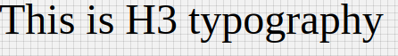

# H3 Component

Typography component for h3 headings. It applies following styles. Styles are fixed, cannot be overriden.

```javascript
{
    'fontFamily':'Roboto',
    'fontWeight':400,
    'fontSize':48,
    'letterSpacing': 0
 };
```

## Compatibility

| 🌏 Web | 🖥 Electron | 📱 React Native |
| :----: | :---------: | :-------------: |
|  ✔️       | ✖            |✖            |

## Screenshots

| 🌏 Web | 🖥 Electron | 📱 React Native |
| :---: | :--------: | :------------: |
|     |    TBD   |  TBD |

### Props

| Name     | Type      | Default | Description                |
| :------- | :-------- | :------ | :------------------------- |
| children | string |         | The text to show with H3 heading style|
| style | object |         | style object for H3 |

## How to use

```javascript
import React from 'react';
import BR from '@blueeast/bluerain-os';

const H3 = BR.Components.get('H3');

const H3Sample = (props) => (
       <H3>H33 Typography</H3>
    );
export default H3Sample;

```