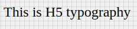

# H5 Component

Typography component for h5 headings. It applies following styles. Styles are fixed, cannot be overriden.

```javascript
{
    'fontFamily':'Roboto',
    'fontWeight':'400',
    'fontSize':24,
    'letterSpacing': 0
 }
```

## Compatibility

| 🌏 Web | 🖥 Electron | 📱 React Native |
| :----: | :---------: | :-------------: |
| ✔️     | ✔️          | ✖               |

## Screenshots

| 🌏 Web | 🖥 Electron | 📱 React Native                       |
| :----: | :---------: | :-----------------------------------: |
| TBD    | TBD         |  |

### Props

| Name     | Type   | Default | Description                            |
| :------- | :----- | :------ | :------------------------------------- |
| children | string |         | The text to show with H5 heading style |

## How to use

```javascript
import React from 'react';
import BR from '@blueeast/bluerain-os';

const H5 = BR.Components.get('H5');

const H5Sample = (props) => (
       <H5>H5 Typography</H5>
    );
export default H5Sample;
```