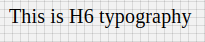

# H6 Component

Typography component for headings. It applies following styles. Styles are fixed, cannot be overriden.

```javascript
{
    'fontFamily':'Roboto',
    'fontWeight':500,
    'fontSize':20,
    'letterSpacing': 0.15
 }
```

## Compatibility

| 🌏 Web | 🖥 Electron | 📱 React Native |
| :----: | :---------: | :-------------: |
| ✔️      | ✔️            | ✖                |

## H6

### Props

| Name     | Type      | Default | Description                |
| :------- | :-------- | :------ | :------------------------- |
| children | string |         | The text to show with H6 heading style

## Screenshots

| 🌏 Web | 🖥 Electron | 📱 React Native |
| :---: | :--------: | :------------: |
|   TBD  |    TBD   |  |

## How to use

```react
import React from 'react';

const H6 = BR.Components.get('H6');


const component = (props) => {
        <H6>H6 Typography</H6>
    );
}

```