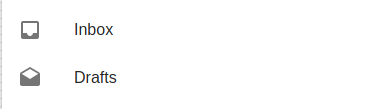
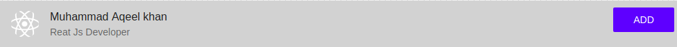

# List

## Compatibility

| 🌏 Web | 🖥 Electron | 📱 React Native |
| :----: | :---------: | :-------------: |
|  ✔️       | ✖            |✖            |

## Screenshots

| 🌏 Web | 🖥 Electron | 📱 React Native |
| :---: | :--------: | :------------: |
|     |    TBD   |  TBD |
|     |    TBD   |  TBD |

## Universal Props

| Name | Type | Default | Description |
|:-----|:-----|:--------|:------------|
| style | Object | | style object for List. |
| children | ReactNode | | Children of List component. |

## Specific Library Props

| Name | Type | Default | Description |
|:-----|:-----|:--------|:------------|
| className | string |  | className to give css styling. |
| subheader | ReactNode |  |  subbheader of List. |
| disablePadding | bool |  | If true, padding is disabled. |
| dense | bool |  | If true, dense styling is used.. |

## ListItem

## ListItem Universal Props

| Name     | Type   | Default | Description                 |
| :------- | :----- | :------ | :-------------------------- |
| style    | Object |         | style object for ListItem Component.      |
| children | ReactNode   |         | Children of ListItem Component. |
| primary | ReactNode   |         | primary of ListItem Component. |
| secondary    | ReactNode |         | secondary for ListItem Component.      |
| action   | ReactNode |         | action for ListItem Component.      |
| avatar   | ReactNode |         | avatar for ListItem Component.      |
| onPress | (event:object) => void   |         | onPress of ListItem Component. |

## ListItem Specific Library Props

| Name | Type | Default | Description |
|:-----|:-----|:--------|:------------|
| className | string |  | className to extend styling of Listitem. |
| button | bool |  | If true, ListItem will be a button. |
| component | string | li | component with which ListItem will be rendered. |
| href | string |  | src to which the ListItem will be directed. |
| onClick | function |  | If button/active, function to be called back when clicked. |
| disabled | bool |  | If true, ListItem is rendered disabled. |

## How to use

```JavaScript
import * as React from 'react';
import BR from '@blueeast/bluerain-os';

const ListSubheader = BR.Components.get('ListSubheader');
const List = BR.Components.get('List');
const ListItem = BR.Components.get('ListItem');

const ListView = () =>{
 return(
    <List style={{ width:'100%' }} subheader={ <ListSubheader >SubHeading</ListSubheader>}>
      <ListItem
        avatar={<Thumbnail source={{ uri: 'https://facebook.github.io/react-native/img/header_logo.png' }} style={{ backgroundColor: 'black' }} square />}
        style={{ width: '100%' }}
        primary="Aqeel khan"
        secondary="Reat Js developer"
      />
    </List>
  );
}
```
