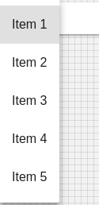

# Menu

Menus display a list of choices on temporary surfaces.
A Menu displays a list of choices on a temporary surface. They appear when users interact with a button, action, or other control.

## Compatibility

| 🌏 Web | 🖥 Electron | 📱 React Native |
| :----: | :---------: | :-------------: |
|  ✔️       | ✖            |✖            |

## Screenshots

| 🌏 Web | 🖥 Electron | 📱 React Native |
| :---: | :--------: | :------------: |
|     |    TBD   |  TBD |

## Universal Props

| Name | Type | Default | Description |
|:-----|:-----|:--------|:------------|
| style | Object | | style object for Menu Component. |
| children | ReactNode | | Children of Menu component. |

## MenuItem

## MenuItem Universal Props

| Name     | Type   | Default | Description                 |
| :------- | :----- | :------ | :-------------------------- |
| disabled    | bool |         | disabled the MenuItem Component.      |
| value | string   |         | key value of of MenuItem Component. |

## MenuItem Specific Library Props

| Name | Type | Default | Description |
|:-----|:-----|:--------|:------------|
| classes | object |  | classes to extend styling of MenuItem component. |
| children | ReactNode |  | Children of MenuItem component. |

## How to use

```JavaScript
import * as React from 'react';
import BR from '@blueeast/bluerain-os';

const Menu = BR.Components.get('Menu');
const MenuItem = BR.Components.get('MenuItem');

const MenuSample = () =>{
 return(
   <Menu open={false} style={style.dropdown}>
      <MenuItem value="xyz">Item 1 </MenuItem>
      <MenuItem value="abc">Item 2 </MenuItem>
      <MenuItem value="cba">Item 3 </MenuItem>
      <MenuItem value="cab">Item 4 </MenuItem>
      <MenuItem value="acb">Item 5 </MenuItem>
    </Menu>
  );
}

export default MenuSample;
```
