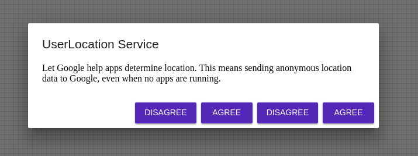

# Modal

## Compatibility

| 🌏 Web | 🖥 Electron | 📱 React Native |
| :----: | :---------: | :-------------: |
| ✔️     | ✖           | ✖               |

## Screenshots

| 🌏 Web                                | 🖥 Electron | 📱 React Native |
| :-----------------------------------: | :---------: | :-------------: |
|  | TBD         | TBD             |


## Universal Props

| Name                  | Type       | Default                                                                          | Description                                     |
| :-------------------- | :--------- | :------------------------------------------------------------------------------- | :---------------------------------------------- |
| onRequestClose        | () => void |                                                                                  | onRequestCloset prop for Modal Component.       |
| onShow                | () => void |                                                                                  | onShow prop for Modal component.                |
| onDismiss             | () => void |                                                                                  | call onDismiss prop for Modal component.        |
| transparent           | boolean    |                                                                                  | transparent prop for Modal component.           |
| visible               | boolean    |                                                                                  | visible prop for Modal component.               |
| hardwareAccelerated   | boolean    |                                                                                  | hardwareAcceleratedfor prop Modal component.    |
| onOrientationChange   | () => void |                                                                                  | onOrientationChange prop for Modal component.   |
| presentationStyle     | enum       | 'fullScreen','pageSheet','formSheet','overFullScreen'                            | onOrientationChange prop for Modal component.   |
| onOrientationChange   | () => void |                                                                                  | onOrientationChange prop for Modal component.   |
| supportedOrientations | enum       | 'portrait','portrait-upside-down','landscape','landscape-left','landscape-right' | supportedOrientations prop for Modal component. |
| animationType         | enum       | 'none','slide','fade'                                                            | animationType prop for Modal component.         |
| animationType         | enum       | 'none','slide','fade'                                                            | animationType prop for Modal component.         |

## Modal Specific Library Props

| Name                 | Type       | Default            | Description                                                        |
| :------------------- | :--------- | :----------------- | :----------------------------------------------------------------- |
| fullScreen           | boolean    |                    | fullScreen prop for Modal component.                               |
| fullWidth            | boolean    |                    | fullWidth prop for Modal component.                                |
| visible              | boolean    |                    | visible prop Modal component.                                      |
| onClose              | () => void |                    | onClose prop for Modal component.                                  |
| maxWidth             | enum       | 'xs' , 'sm' , 'md' | maxWidth prop for Modal component.                                 |
| children             | ReactNode  |                    | Children of Modal component.                                       |
| disableBackdropClick | boolean    |                    | If true, clicking the backdrop will not fire the onClose callback. |
| disableEscapeKeyDown | boolean    |                    | If true, hitting escape will not fire the onClose callback.        |
| onBackdropClick      | () => void |                    | Callback fired when the backdrop is clicked                        |
| onEnter              | () => void |                    | Callback fired before the dialog enters.                           |
| onEntered            | () => void |                    | Callback fired when the dialog has entered                         |
| onEntering           | () => void |                    | Callback fired when the dialog is entering                         |
| onEscapeKeyDown      | () => void |                    | Callback fired when the dialog is entering.                        |
| disableBackdropClick | boolean    |                    | If true, clicking the backdrop will not fire the onClose callback. |
| disableBackdropClick | boolean    |                    | If true, clicking the backdrop will not fire the onClose callback. |
| onExit               | () => void |                    | Callback fired before the dialog exits.                            |
| onExited             | () => void |                    | Callback fired when the dialog has exited..                        |
| open                 | boolean    |                    | If true, the Dialog is open.                                       |
|                      |
| PaperProps           | open       |                    |                                                                    | Properties applied to the Paper element.. |
| scroll               | string     | 'body','paper'     |                                                                    |                                           | Determine the container for scrolling the dialog. |
|                      |
| TransitionComponent  | string     | Fade               | Transition component.                                              |
|                      |
| TransitionProps      | object     | Fade               | Properties applied to the Transition element.                      |
|                      |


## ModalBody Universal Props

| Name                 | Type      | Default | Description                                   |
| :------------------- | :-------- | :------ | :-------------------------------------------- |
| children             | ReactNode |         | children prop ModalBody Component.            |
| classes              | object    |         | classes prop is used for ModalBody Component. |
| disableActionSpacing | boolean   |         | disableActionSpacing for ModalBody Component. |
| style                | object    |         | style prop for ModalBody Component.           |

## ModalFooter Universal Props

| Name                 | Type      | Default | Description                                     |
| :------------------- | :-------- | :------ | :---------------------------------------------- |
| children             | ReactNode |         | children prop ModalFooter Component.            |
| classes              | object    |         | classes prop is used for ModalFooter Component. |
| disableActionSpacing | boolean   |         | disableActionSpacing for ModalFooter Component. |
| style                | object    |         | style prop for ModalFooter Component.           |

## ModalHeader Universal Props

| Name     | Type      | Default | Description                                     |
| :------- | :-------- | :------ | :---------------------------------------------- |
| children | ReactNode |         | children prop ModalHeader Component.            |
| classes  | object    |         | classes prop is used for ModalHeader Component. |
| style    | object    |         | style prop for ModalHeader Component.           |


## ModalBodyText Universal Props

| Name     | Type      | Default | Description                                     |
| :------- | :-------- | :------ | :---------------------------------------------- |
| children | ReactNode |         | children prop ModalBodyText Component.          |
| classes  | object    |         | classes prop is used for ModalHeader Component. |
| style    | object    |         | style prop for ModalBodyText Component.         |

## How to use

```JavaScript
import * as React from 'react';
import BR from '@blueeast/bluerain-os';

const Modal = BR.Components.get('Modal');
const MenuBody = BR.Components.get('ModalBody');
const MenuHeader = BR.Components.get('ModalHeader');
const MenuFooter = BR.Components.get('ModalFooter');
const Button = BR.Components.get('Button');

const ModalSample = () =>{
 return(
    <Modal
          open={true}
          onClose={this.handleClose}
          fullWidth={props.fullWidth}
          fullScreen={props.fullScreen}
        >
          <ModalHeader>
          UserLocation Service
          </ModalHeader>
          <ModalBody>
           <ModalBodyText>
           Let Google help apps determine location. This means sending anonymous location data to
            Google, even when no apps are running.
           </ModalBodyText>
          </ModalBody>
          <ModalFooter>

          <Button onPress={this.handleClose} color="primary">
              Disagree
            </Button>
            <Button onPress={this.handleClose} color="primary" >
              Agree
            </Button>
            <Button onPress={this.handleClose} color="primary">
              Disagree
            </Button>
            <Button onPress={this.handleClose} color="primary" >
              Agree
            </Button>
          </ModalFooter>
        </Modal>
  );
}

export default ModalSample;
```