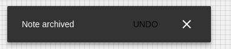

# Notification

## Compatibility

| 🌏 Web | 🖥 Electron | 📱 React Native |
| :----: | :---------: | :-------------: |
| ✔️      | ✖            | ✖              |

## Screenshots

| 🌏 Web | 🖥 Electron | 📱 React Native |
| :---: | :--------: | :------------: |
|  |    TBD   | TBD |

## Universal Props

| Name | Type | Default | Description |
|:-----|:-----|:--------|:------------|
| onClose | () => void|  | Called just before the toast hides. It is in native base |
| text | string | | Text content to be shown in the toast |
| textStyle | string | |Style text content for toast|
| buttonText | string|  | Text to be displayed inside the button |
| buttonTextStyle| object | |Style button text for toast|
| position | enum| 'top','bottom' |Sets position for the toast|
| type | enum| 'danger' , 'success' , 'warning'| Sets context to the Toast|
| duration | number| | Milliseconds after which Toast disappers |

## Props

| Name | Type | Default | Description |
|:-----|:-----|:--------|:------------|
| open | boolean |  | open prop for the Notification component |
| message | string | |message prop for the Notification component |
| children | ReactNode | | Children prop for Notification. |
| action | any| | action prop for Notification Component. |
| autoHideDuration| number | | autoHideDuration props for Notification. |
| resumeHideDuration | number | | resumeHideDuration props for Notification. |
| SnackbarContentProps| object | | SnackbarContentProps props for Notification. |

## How to use

```JavaScript
import React from 'react';
import BR from '@blueeast/bluerain-os';

const NotificationSample = (props) => (
    const Notification = BR.Components.get('Notificaton');
   return (
    <Notification
      open={() => console.log('open')}
      onClose={() => console.log('open')}
      transition={''}
      SnackbarContentProps={{ 'aria-describedby': 'message-id' }}
      text={<span id="message-id">I love snacks</span>}

    />
     );

export default NotificationSample;
```