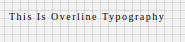

# Overline Component

Typography component for Overline text. It applies following styles. Styles are fixed, cannot be overriden.

```javascript
{
    'fontFamily':'Roboto',
    'fontWeight':500,
    'fontSize':10,
    'letterSpacing': 1.5,
    'textTransform':'Capitalize'
 }
```

## Compatibility

| 🌏 Web | 🖥 Electron | 📱 React Native |
| :----: | :---------: | :-------------: |
|✔️       |✖           |  ✖            |

## Overline

## Screenshots

| 🌏 Web | 🖥 Electron | 📱 React Native                             |
| :----: | :---------: | :-----------------------------------------: |
|    | TBD         |TBD      |

### Props

| Name     | Type      | Default | Description                |
| :------- | :-------- | :------ | :------------------------- |
| children | string |         | The text to show with Overline heading style
| style | object |         | style object for Overline |

## How to use

```javascript
import React from 'react';
import BR from '@blueeast/bluerain-os';

const Overline = BR.Components.get('Overline');

const OverlineSample = (props) => (
        <Overline>Overline Typography</Overline>
    );
export default OverlineSample;

```