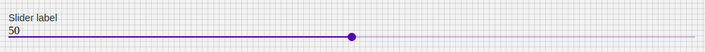

# Slider

## Compatibility

| 🌏 Web | 🖥 Electron | 📱 React Native |
| :----: | :---------: | :-------------: |
| ✖      | ✖           | ✔️              |

## Screenshots

| 🌏 Web                                    | 🖥 Electron | 📱 React Native |
| :---------------------------------------: | :---------: | :-------------: |
|  |             | TBD             |

## Universal Props

| Name              | Type     | Default | Description                                                                                     |
| :---------------- | :------- | :------ | :---------------------------------------------------------------------------------------------- |
| style             | Object   |         | Get the style object                                                                            |
| disabled          | bool     |         | if true, slider is rendered in disabled form..                                                  |
| value             | number   |         | value of the slider.                                                                            |
| onChange          | function |         | Invoked with the new value when the value changes.                                              |
| onSlidingComplete | function |         | Invoked with when Sliding is completed.                                                         |
| max               | number   |         | minimium value for slider.                                                                      |
| min               | number   |         | maximium value for slider.                                                                      |
| steps             | number   |         | number of steps for slider.                                                                     |
| onDragEnd         | ()=>void |         | Callback function that is fired when the slide has stopped moving.                              |
| onDragStart       | ()=>void |         | Callback function that is fired when the slider has begun to move.                              |
| step              | number   |         | The granularity the slider can step through values.                                             |
| thumb             | number   |         | The component used for the slider icon. This is optional, if provided should be a react element | value | number |  | The value of the slider. |
| Vertical          | number   |         | If true, the slider will be vertical.                                                           |
## How to use

```JavaScript
import React from 'react';
import BR from '@blueeast/bluerain-os';

const SliderSample = (props) => {
    const Slider = BR.Components.get('Slider');
    return (
      <Slider
          min={0}
          max={100}
          defaultValue={6}
          value={value}
          aria-labelledby="label"
          onChange={this.handleChange}
          {...this.props}
          step={5}
        />
    );
}
export default SliderSample;
```