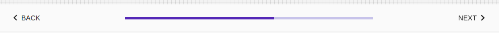

# Stepper

Steppers display progress through a sequence of logical and numbered steps. They may also be used for navigation. Steppers may display a transient feedback message after a step is saved

## Compatibility

| 🌏 Web | 🖥 Electron | 📱 React Native |
| :----: | :---------: | :-------------: |
| ✔️      | ✖            | ✖              |

## Screenshots

| 🌏 Web | 🖥 Electron | 📱 React Native |
| :---: | :--------: | :------------: |
|  |    TBD   | TBD |

## Universal Props

| Name | Type | Default | Description |
|:-----|:-----|:--------|:------------|
| activeStep |number|  | Set the active step (zero based index).Defines which dot is highlighted when the variant is 'dots'. |
| classes | object | | Useful to extend the style applied to components. |
| style| object | |Useful to extend the style applied to components. |
| steps | number | | The total steps for stepper |

## Props

| Name | Type | Default | Description |
|:-----|:-----|:--------|:------------|
| backButton | ReactNode| | backButton prop for Stepper. |
| nextButton  |ReactNode| | nextButton prop for Stepper. |
| position | enum | 'top','bottom'| position for Stepper|
| type | enum | 'dot','text'| type prop for Stepper|

## How to use

```JavaScript
import React from 'react';
import BR from '@blueeast/bluerain-os';

const StepperSample = (props) => (
    const Stepper = BR.Components.get('Stepper');
    const Button = BR.Components.get('Button');
    const backButton =<Button>back</Button>;
    const nextButton =<Button>next</Button>;
   return (
     <Stepper
      type="progress"
       activeStep={3}
       backButton={backButton}
       nextButton={nextButton}
       steps={6}  
        />
     );

export default StepperSample;
```