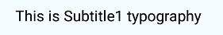

# Subtitle1 Component

Typography component for subtitle. It applies following styles. Styles are fixed, cannot be overriden.

```javascript
{
    'fontFamily': 'Roboto',
    'fontWeight': '400',
    'fontSize': 20,
    'letterSpacing': 0.15
}
```

## Compatibility

| 🌏 Web | 🖥 Electron | 📱 React Native |
| :----: | :---------: | :-------------: |
| ✔️     | ✔️          | ✖               |

## Subtitle1

### Props

| Name     | Type   | Default | Description                                   |
| :------- | :----- | :------ | :-------------------------------------------- |
| children | string |         | The text to show with Subtitle1 heading style |

## Screenshots

| 🌏 Web | 🖥 Electron | 📱 React Native                              |
| :----: | :---------: | :------------------------------------------: |
| TBD    | TBD         |  |

## How to use

```react
import React from 'react';

const Subtitle1 = BR.Components.get('Subtitle1');


const component = (props) => {
        <Subtitle1>Subtitle1 Typography</Subtitle1>
    );
}

```