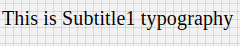

# Subtitle1 Component

Typography component for subtitle1. It applies following styles. Styles are fixed, cannot be overriden.

```javascript
{
    'fontFamily': 'Roboto',
    'fontWeight': '400',
    'fontSize': 20,
    'letterSpacing': 0.15
}
```

## Compatibility

| 🌏 Web | 🖥 Electron | 📱 React Native |
| :----: | :---------: | :-------------: |
|✔️     |✔️        |   ✖          |

## Subtitle1

## Screenshots

| 🌏 Web | 🖥 Electron | 📱 React Native                             |
| :----: | :---------: | :-----------------------------------------: |
|   | TBD         | TBD |

### Props

| Name     | Type      | Default | Description                |
| :------- | :-------- | :------ | :------------------------- |
| children | string |         | The text to show with Subtitle1 heading style
| style | object |         | style object for Subtitle1 |

## How to use

```javascript
import React from 'react';
import Br from '@blueeast/bluerain-os';

const Subtitle1 = BR.Components.get('Subtitle1');

const Subtitle1Sample = (props) => ()
        <Subtitle1>Subtitle1Typography</Subtitle1>
    );

export default Subtitle1Sample;

```