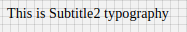

# Subtitle2 Component

Typography component for subtitle. It applies following styles. Styles are fixed, cannot be overriden.

```javascript
{
    'fontFamily': 'Roboto',
    'fontWeight': '400',
    'fontSize': 14,
    'letterSpacing': 0.1
}
```

## Compatibility

| 🌏 Web | 🖥 Electron | 📱 React Native |
| :----: | :---------: | :-------------: |
| ✔️      | ✔️          |    ✖          |

## Subtitle2

### Props

| Name     | Type      | Default | Description                |
| :------- | :-------- | :------ | :------------------------- |
| children | string |         | The text to show with Subtitle2 heading style|

## Screenshots

| 🌏 Web | 🖥 Electron | 📱 React Native                             |
| :----: | :---------: | :-----------------------------------------: |
|    | TBD         | TBD |

## How to use

```react
import React from 'react';

const Subtitle2 = BR.Components.get('Subtitle2');


const component = (props) => {
        <Subtitle2>Subtitle2 Typography</Subtitle2>
    );
}

```