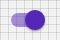

# Switch

## Compatibility

| 🌏 Web | 🖥 Electron | 📱 React Native |
| :----: | :---------: | :-------------: |
| ✔️      | ✖            | ✖              |

## Screenshots

| 🌏 Web | 🖥 Electron | 📱 React Native |
| :---: | :--------: | :------------: |
|  |    TBD   | TBD |

## Universal Props

| Name | Type | Default | Description |
|:-----|:-----|:--------|:------------|
| style | Object |  | Get the style object |
| disabled | bool | | if true, switch is rendered in disabled form.. |
| value | bool | | value of the switch. |
| onValueChange | function | | Invoked with the new value when the value changes. |

## Specific Library Props

| Name | Type | Default | Description |
|:-----|:-----|:--------|:------------|
| checked | string or bool |  | Keeps the value unchanged. |
| classes | object | | classes prop to override styling. |

## How to use

```JavaScript
import React from 'react';
import BR from '@blueeast/bluerain-os';

const Switch = (props) => {
    const Switch = BR.Components.get('Switch');
    return (
        <Switch
            disabled={false}
            value={true}
            onValueChange={console.log('Value changed!')}
             />
    );
}
export default Switch;
```