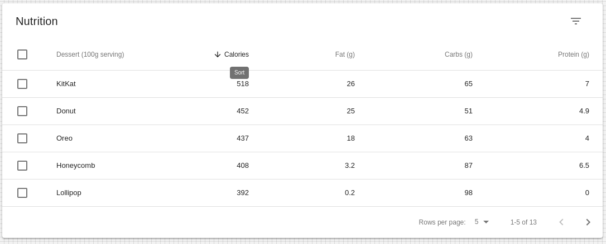

# Table

## Compatibility

| 🌏 Web | 🖥 Electron | 📱 React Native |
| :----: | :---------: | :-------------: |
|  ✔️       | ✖            |✖            |

## Screenshots

| 🌏 Web | 🖥 Electron | 📱 React Native |
| :---: | :--------: | :------------: |
|     |    TBD   |  TBD |

## Table Props

| Name | Type | Default | Description |
|:-----|:-----|:--------|:------------|
| style | Object | | style object for List. |
| children | ReactNode | | Children of List component. |
| classes | object | |Override or extend the styles applied to the component. |
| component | string , func, object | | The component used for the root node. Either a string to use a DOM element or component.|
| padding | 'default' ,'checkbox' ,'dense' ,'none' | | Allows TableCells to inherit padding of the Table.|

## TableHead Props

| Name | Type | Default | Description |
|:-----|:-----|:--------|:------------|
| children | ReactNode |  | The content of the component, normally TableRow. |
| classes | object |  | Override or extend the styles applied to the component. See CSS API below for more details. |
| component | string, func, object |  |The component used for the root node. Either a string to use a DOM element or a component. |

## TableFooter Props

| Name | Type | Default | Description |
|:-----|:-----|:--------|:------------|
| children | ReactNode |  | The content of the component, normally TableRow. |
| classes | object |  | Override or extend the styles applied to the component. See CSS API below for more details. |
| component | string, func, object |  |The component used for the root node. Either a string to use a DOM element or a component. |

## TableBody Props

| Name | Type | Default | Description |
|:-----|:-----|:--------|:------------|
| children | ReactNode |  | The content of the component, normally TableRow. |
| classes | object |  | Override or extend the styles applied to the component. See CSS API below for more details. |
| component | string, func, object |  |The component used for the root node. Either a string to use a DOM element or a component. |

## TableRow Props

| Name | Type | Default | Description |
|:-----|:-----|:--------|:------------|
| children | ReactNode |  | The content of the component, normally TableRow. |
| classes | object |  | Override or extend the styles applied to the component. See CSS API below for more details. |
| component | string, func, object |  |The component used for the root node. Either a string to use a DOM element or a component. |
| hover | bool |  | If true, the table row will shade on hover. |
| selected | bool |  |If true, the table row will have the selected shading.|

## TableCell Props

| Name | Type | Default | Description |
|:-----|:-----|:--------|:------------|
| children | ReactNode |  | The content of the component, normally TableRow. |
| classes | object |  | Override or extend the styles applied to the component. See CSS API below for more details. |
| component | string, func, object |  |The component used for the root node. Either a string to use a DOM element or a component. |
| numeric | bool |  | If true, content will align to the right. |
|padding | 'default' ,'checkbox', 'dense', 'none'|  | Sets the padding applied to the cell |
| scope | string |  |Set scope attribute. |
| sortDirection | 'asc', 'desc',false |  | Set aria-sort direction. |
| variant | 'head', 'body', 'footer' |  | Specify the cell type. |

## TablePagination Props

| Name | Type | Default | Description |
|:-----|:-----|:--------|:------------|
| ActionsComponent |  string, func, object |  | The component used for displaying the actions. Either a string to use a DOM element or a component. |
| classes | object |  | Override or extend the styles applied to the component. See CSS API below for more details. |
| component | string, func, object |  |The component used for the root node. Either a string to use a DOM element or a component. |
| backIconButtonProps | object |  | Properties applied to the back arrow IconButton component.|
|count |  number |  | The total number of rows. |
|labelDisplayedRows | func |  |Customize the displayed rows label. |
|labelRowsPerPage | ReactNode |  | Customize the rows per page label. |
| variant | 'head', 'body', 'footer' |  | Specify the cell type. |
| nextIconButtonProps | object |  | Properties applied to the next arrow IconButton element. |
| onChangePage | func |  | Callback fired when the page is changed. |
| Signature | function(event: object, page: number) => void |  |  |
| page | number|  |The zero-based index of the current page. |
| rowsPerPage | number |  | The number of rows per page. |
|rowsPerPageOptions | array[10, 25, 50, 100] |  | Customizes the options of the rows per page select field. |
| SelectProps | object |  |  If less than two options are available, no select field will be displayed. |

## TableSortLabel Props

| Name | Type | Default | Description |
|:-----|:-----|:--------|:------------|
| active | bool |  | If true, the label will have the active styling. |
| children | ReactNode |  | The content of the component, normally TableRow. |
| classes | 'asc', 'desc' |  | Override or extend the styles applied to the component.|
| direction | object |  | The current sort direction. |
| hideSortIcon| bool |  | Hide sort icon when active is false. |
| IconComponent | func |  | ArrowDownwardIcon Sort icon to use.|

## How to use

```JavaScript
import * as React from 'react';
import BR from '@blueeast/bluerain-os';

const Table = BR.Components.get('Table');
const TableCell = BR.Components.get('TableCell');
const TableBody = BR.Components.get('TableBody');
const TableHead = BR.Components.get('TabeHead');
const TableFooter = BR.Components.get('TableFooter');
const TableRow = BR.Components.get('TableRow');
const TablePagination = BR.Components.get('TablePagination');
const TableSortLabel = BR.Components.get('TableSortLabel');

const SampleTable = () => {
 return(
   <Table>
            <TableHead
              numSelected={selected.length}
              order={order}
              orderBy={orderBy}
              onSelectAllClick={this.handleSelectAllClick}
              onRequestSort={this.handleRequestSort}
              rowCount={data.length}
            />
            <TableBody>
              {stableSort(data, getSorting(order, orderBy))
                .slice(page * rowsPerPage, page * rowsPerPage + rowsPerPage)
                .map((n:any) => {
                  const isSelected = this.isSelected(n.id);
                  return (
                    <TableRow
                      hover
                      onClick={(event:any) => this.handleClick(event, n.id)}
                      role="checkbox"
                      aria-checked={isSelected}
                      // tabIndex={-1}
                      key={n.id}
                      selected={isSelected}
                    >
                      <TableCell component="th" scope="row" padding="none">
                        {n.name}
                      </TableCell>
                      <TableCell numeric>{n.calories}</TableCell>
                      <TableCell numeric>{n.fat}</TableCell>
                      <TableCell numeric>{n.carbs}</TableCell>
                      <TableCell numeric>{n.protein}</TableCell>
                    </TableRow>
                  );
                })}
              {emptyRows > 0 && (
                <TableRow >
                  <TableCell colSpan={6} />
                </TableRow>
              )}
            </TableBody>
          </Table>
  );
}
```
