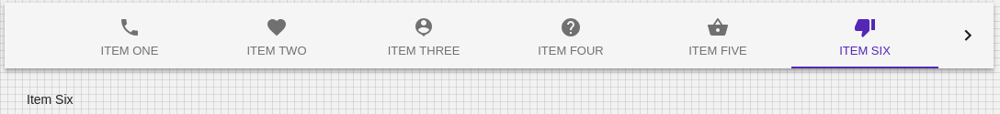

# Tabs

## Compatibility

| 🌏 Web | 🖥 Electron | 📱 React Native |
| :----: | :---------: | :-------------: |
|  ✔️       | ✖            |✖            |

## Screenshots

| 🌏 Web | 🖥 Electron | 📱 React Native |
| :---: | :--------: | :------------: |
|     |    TBD   |  TBD |

## Tabs Props

| Name | Type | Default | Description |
|:-----|:-----|:--------|:------------|
| action | func | | Callback fired when the component mounts. |
| children | ReactNode | | Children of component. |
| classes | object | |Override or extend the styles applied to the component. |
| component | string , func, object | | The component used for the root node. Either a string to use a DOM element or component.|
|value |any| | The value of the currently selected Tab.|
| classes | object | |Override or extend the styles applied to the component. |
| textColor | 'secondary', 'primary', 'inherit'| |Determines the color of the Tab.|
|TabIndicatorProps | object | |Properties applied to the TabIndicator element.|
|scrollButtons| 'auto', 'on', 'off' | |Determine behavior of scroll buttons when tabs are set to scroll. |
|ScrollButtonComponent| string, func, object | |TabScrollButton The component used to render the scroll buttons. |
| scrollable | bool | |True invokes scrolling properties and allow for horizontally scrolling (or swiping) the tab bar.|
|Signature | function(event: object, value: number) => void | |Override or extend the styles applied to the component. |
| onChange | func| |Callback fired when the value changes.|
| indicatorColor | 'secondary', 'primary', 'secondary' | |Determines the color of the indicator. |
| fullWidth | bool | |If true, the tabs will grow to use all the available space.|
| centered | bool | | If true, the tabs will be centered. This property is intended for large views. |

## Tab Props

| Name | Type | Default | Description |
|:-----|:-----|:--------|:------------|
| children | ReactNode |  | The content of the component. |
| classes | object |  | Override or extend the styles applied to the component. |
| component | string, func, object |  |The component used for the root node. Either a string to use a DOM element or a component. |
| disabled| bool| false | If true, the tab will be disabled. |
| icon | ReactNode |  | The icon element. |
|label| ReactNode |  | The label element. |
|value | any |  | You can provide your own value. |

## How to use

```JavaScript
import * as React from 'react';
import BR from '@blueeast/bluerain-os';

const Tabs = BR.Components.get('Tabs');
const Tab = BR.Components.get('Tab');

handleChange = (event: any ) => {
    value =event.target.value;
  };

const SampleTabs = () => {
 return(
  <Tabs
            value={value}
            onChange={handleChange}
            scrollable
            scrollButtons="on"
            indicatorColor="primary"
            textColor="primary"
          >
            <Tab label="Item One"  />
            <Tab label="Item Two"  />
            <Tab label="Item Three"/>
            <Tab label="Item Four" />
            <Tab label="Item Five" />
            <Tab label="Item Six"  />
            <Tab label="Item Seve" />
          </Tabs>
  );
}
```
