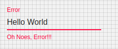

# TextInput

TextInput allow users to enter text into a UI. They typically appear in forms and dialogs

## Compatibility

| 🌏 Web | 🖥 Electron | 📱 React Native |
| :----: | :---------: | :-------------: |
| ✔️      | ✖            | ✖              |

## Screenshots

| 🌏 Web | 🖥 Electron | 📱 React Native |
| :---: | :--------: | :------------: |
|  |    TBD   | TBD |

## Universal Props

| Name | Type | Default | Description |
|:-----|:-----|:--------|:------------|
| autoFocus | boolean | false | TextInput gets focus on firstmount if true |
| multiline | boolean | | Allows multiline textInput |
| placeholder | string | | Placeholder of TextInput |
| editable | boolean |true | If false, TextInput is not editable |
| style | object | | This prop styles the TextInput |
| onChange | func | | Callback that is called when the text input's text changes. |

## Specific Library Props

| Name | Type | Default | Description |
|:-----|:-----|:--------|:------------|
| autoComplete | string |  | This property helps users to fill forms faster, especially on mobile devices. The name can be confusion, it's more like an autofill.  |
| id | string | | The id of the input element. |
| label | string | | The label content.|
| className | string | |  |
| margin | enum: 'none' 'dense' 'normal' | | If dense or normal, will adjust vertical spacing of this and contained components. |
| required | boolean | false | If true, the label is displayed as required. |
| error | boolean | | If true, the label will be displayed in an error state. |
| type | string | | Type attribute of the Input element. It should be a valid HTML5 input type. |
| rowsMax | string, number | | Maximum number of rows to display when multiline option is set to true. |
| rows | string, number | | Number of rows to display when multiline option is set to true. |
| helperText | ReactNode | | The helper text content. |
| InputLabelProps | object | | Properties applied to the InputLabel element. |
| fullWidth | boolean | | If true, the input will take up the full width of its container. |

## How to use

```JavaScript
import React from 'react';
import { withBluerain } from "@blueeast/bluerain-os";

function handleTextInputChange (value: any) {
   console.log('text input value', value.target.value);
}

const appPage = (props) => {
    const BR = props.bluerain;
    const TextInput = BR.Components.get('TextInput');
    return (
        <TextInput placeholder="hello" defaultValue="nooo" onChange={handleTextInputChange} autoComplete="Hello World !!" autoFocus={true} />
    )
}

export default withBluerain(appPage);
```
